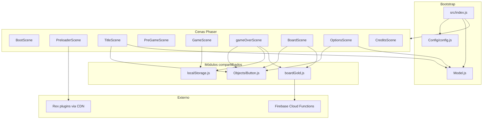

# Arquitetura do projeto

## Diagrama geral



## Bootstrap — `src/index.js`

- Estende `Phaser.Game` com `config` de `Config/config.js`
- Cria `Model` e armazena em `this.globals = { model, bgMusic: null }`
- Registra as 9 cenas e inicia `"Boot"`
- Expõe `window.game` globalmente
- Importa CSS global de `assets/style/style.css`

## Config — `src/Config/config.js`

| Opção | Valor |
|-------|-------|
| `type` | `Phaser.AUTO` |
| `parent` | `"divId"` (ver gotchas — HTML não tem esse elemento) |
| `width` / `height` | 800 × 600 |
| `dom.createContainer` | `true` (necessário para input DOM no gameOver) |
| Physics | Arcade, gravity Y = 500 |

## Model — `src/Model.js`

Singleton de estado de **áudio** apenas:

| Propriedade | Default | Uso |
|-------------|---------|-----|
| `musicOn` | `true` | TitleScene, OptionsScene |
| `bgMusicPlaying` | `false` | controla se bgMusic já está tocando |
| `soundOn` | não inicializado | getter/setter existe mas **não é usado** |

Acesso: `this.sys.game.globals.model` ou `this.game.globals.model`

## Button — `src/Objects/Button.js`

Único objeto reutilizável. Estende `Phaser.GameObjects.Container`.

**Construtor:** `(scene, x, y, key1, key2, text, targetScene)`

- Sprite com hover (troca textura key1 → key2)
- Click → `scene.start(targetScene)`
- Usado em: Title, Options, gameOver, Board

## Grafo de dependências

```
index.js
├── style.css
├── phaser
├── Config/config.js
├── Model.js
└── Scenes/*
    ├── BootScene.js          → phaser
    ├── PreloaderScene.js     → phaser (+ Rex plugins CDN)
    ├── TitleScene.js         → config, Button, globals.model
    ├── PreGameScene.js       → config
    ├── GameScene.js          → localStorage.storeGolds
    ├── gameOverScene.js      → Button, localStorage, boardGold
    ├── BoardScene.js         → Button, boardGold
    ├── OptionsScene.js       → Button, globals.model
    └── CreditsScene.js       → config

boardGold.js    → fetch (browser global)
localStorage.js → localStorage API (browser)
Button.js       → phaser
```

## Plugins externos (CDN)

Carregados no `PreloaderScene` via `this.load.plugin()`:

| Plugin | Uso |
|--------|-----|
| `rexinputtextplugin` | carregado mas input no gameOver usa DOM nativo |
| `rexgridtableplugin` | BoardScene — tabela top 10 |
| `rexscrollerplugin` | carregado, uso limitado |

Fonte: `raw.githubusercontent.com/rexrainbow/phaser3-rex-notes/master/dist/`

## Assets

Referenciados em `PreloaderScene` com paths relativos:

- `dist/assets/images/` — sprites, plataformas, moedas, fogo, botões (versionados no repo)
- `dist/assets/music/Theme.mp3` — música de fundo

Webpack **não copia** esses assets — eles já ficam em `dist/assets/` e o build só atualiza os `.js`.
