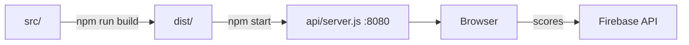

# Build e deploy

## Webpack — `webpack.config.js`

| Setting | Valor |
|---------|-------|
| Entry `app` | `./src/index.js` |
| Entry `production-dependencies` | `["phaser"]` |
| Output | `dist/[name].js` → `app.js` + `production-dependencies.js` |
| CSS | `style-loader` + `css-loader` (injeta no bundle) |
| Imagens | `file-loader` para png/jpg/gif |

**O que webpack NÃO faz:**

- Sem `babel-loader` (transpilação só no Jest)
- Sem `HtmlWebpackPlugin`
- Não copia assets — imagens e som ficam em `dist/assets/` (versionados no repo)

## dist/ — estrutura

```
dist/
  index.html
  app.js
  production-dependencies.js
  assets/
    images/     # sprites, plataformas, menu, screenshots
    music/      # Theme.mp3
```

O `PreloaderScene` carrega de `assets/images/` e `assets/music/` em runtime (paths relativos à raiz servida = `dist/`).

O `npm run build` só atualiza os `.js` — **não apaga** `dist/assets/`.

## Servidor local — `api/server.js`

```javascript
app.use(express.static(`${__dirname}/../dist`));  // serve dist/
app.get("*", ...)                                  // catch-all SPA
app.listen(process.env.PORT || 8080);
```

**Bug no catch-all:** envia `path.resolve(__dirname, "index.html")` → `api/index.html` (não existe). Deveria ser `../dist/index.html`.

**npm start** → `node api/server.js` → http://localhost:8080

## Vercel — `vercel.json`

```json
builds: [
  { "src": "./server.js", "use": "@vercel/node" },   // ❌ não existe na raiz
  { "src": "dist/**", "use": "@vercel/static" }
]
routes: [
  { "src": "/api/(.*)", "dest": "server.js" },       // ❌ sem implementação
  { "src": "/", "dest": "dist/index.html" },
  { "src": "/(.+)", "dest": "dist/$1" }
]
```

**Deploy efetivo:** static hosting de `dist/`. Leaderboard vai direto do browser para Firebase — Vercel não participa.

Live: https://climbing-the-volcano-k1kdpckj8-felipeenne.vercel.app/

## Fluxo de desenvolvimento



## Scripts — `package.json`

| Script | Comando |
|--------|---------|
| `start` | `node api/server.js` |
| `build` | `webpack` |
| `watch` | `webpack --watch` |
| `test` | `jest` |
| `jest-watch` | `jest --watch` |
| `npx-fix` | `npx eslint src/ --fix` |

**Node engine:** 18.x

## Correções planejadas (Fase 2 — commits separados)

Ver `gotchas.md` e `decisoes.md`. Cada fix = um commit isolado:

1. `api/server.js` — catch-all
2. `vercel.json` — remover server.js inexistente
3. webpack — copiar assets para dist
4. `dist/index.html` / `config.js` — divId
5. bugs em cenas (um arquivo por vez)
