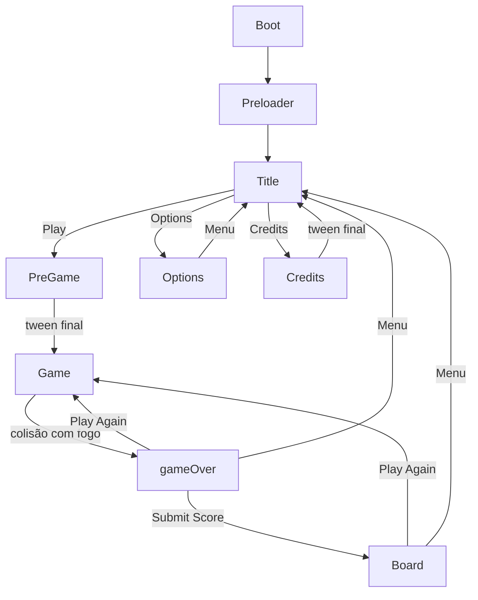

# Cenas do jogo

## Fluxo completo

## Tabela das cenas

| Key | Arquivo | Responsabilidade | Sai para |
|-----|---------|------------------|----------|
| `Boot` | `BootScene.js` | Handoff imediato ao preloader | Preloader |
| `Preloader` | `PreloaderScene.js` | Barra de progresso, carrega assets e plugins Rex | Title |
| `Title` | `TitleScene.js` | Menu principal, inicia música BG | PreGame, Options, Credits |
| `PreGame` | `PreGameScene.js` | Intro da história com tweens (~13s) | Game |
| `Game` | `GameScene.js` | Gameplay principal | gameOver |
| `gameOver` | `gameOverScene.js` | Mostra score, input de nome, submit | Board, Game, Title |
| `Board` | `BoardScene.js` | Top 10 via Rex GridTable | Game, Title |
| `Options` | `OptionsScene.js` | Toggle música on/off | Title |
| `Credits` | `CreditsScene.js` | Créditos com scroll animado | Title |

## Detalhes por cena

### BootScene

- `create()` → `this.scene.start("Preloader")` imediatamente
- Sem assets, sem UI

### PreloaderScene

- Barra de progresso com percentual e nome do asset
- Carrega imagens, áudio, spritesheets e 3 plugins Rex via CDN
- `ready()` incrementa `readyCount`; só vai para Title quando `readyCount === 1`
- Timer de 3s (`delayedCall`) também chama `ready()` — debounce com evento `load.complete`
- Métodos `ready()` comentados permitem debug direto em outras cenas

### TitleScene

- 3 botões via `Button`: Play → PreGame, Options, Credits
- Se `model.musicOn && !model.bgMusicPlaying`: toca `bgMusic` e salva ref em `globals.bgMusic`
- Método `ready()` morto (referencia variáveis globais inexistentes)

### PreGameScene

- Textos da história sobem com tweens (8s, delay 5s)
- Último tween (`gameContext3`) → `scene.start("Game")`
- Bug: `onComplete` usa `this.destroy` sem `()` — cleanup não executa

### GameScene — gameplay

**Variáveis de módulo** (não instância): `player`, `cursors`, `coins`, `platforms`, `gold`, `fires`, etc.

**Mecânicas:**

| Elemento | Comportamento |
|----------|---------------|
| Player (`boy`) | Setas ←→ movem (±300), ↑ pula (-330) se no chão |
| Plataforma base | Estática em y=580 |
| 5 plataformas móveis | Tipos `ground1–8` aleatórios, posição X aleatória, ping-pong horizontal |
| Moedas | 4–8 moedas aleatórias, +10 gold cada |
| Respawn moedas | Quando todas coletadas, respawnam + spawnam fogos |
| Fogos | Quantidade = `Math.round(gold / 100)`, caem de y=16 |
| Colisão fogo | `storeGolds(gold)` → pausa physics → tint vermelho → gameOver |

**Funções auxiliares (módulo):**

- `getRandomInt(min, max)`
- `generatePlataformI(min, max)` — tipos de plataforma
- `generatePlataformX(min, max)` — posições X

### gameOverScene

- Lê score: `getLocalGolds()`
- Input DOM nativo (`add.dom`) para nome do jogador
- Submit → `submitGold(nome, gold)` → quando resolve, vai para Board
- Botões: Play Again → Game, Menu → Title

### BoardScene

- `getGoldBoard()` retorna Promise com scores ordenados
- Monta tabela Rex GridTable com 10 linhas
- Cada célula: posição, score, nome (truncado em 10 chars)
- Botões: Play Again → Game, Menu → Title

### OptionsScene

- Checkbox visual (`checkedBox` / `box`) para música
- Toggle `model.musicOn` → `updateAudio()` para play/stop `globals.bgMusic`
- Botão Menu → Title

### CreditsScene

- Textos sobem com tweens
- Último tween → `scene.start("Title")`
- Mesmo bug de `this.destroy` sem `()` nos tweens intermediários

## Mecanismos de transição

1. **`this.scene.start("Key")`** — direto (Boot, Preloader, PreGame, Game, gameOver, Credits)
2. **`Button`** — `scene.start(targetScene)` no pointerdown (Title, Options, gameOver, Board)
