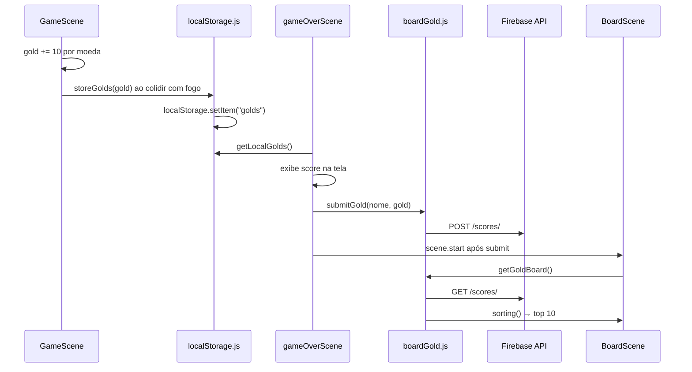

# Dados e persistência

## Pipeline de score (ponta a ponta)



## localStorage.js

Chave: `"golds"` (JSON stringified number)

| Função | Comportamento |
|--------|---------------|
| `localStoreGold(gold)` | `JSON.stringify` + `setItem("golds")` |
| `getLocalGolds()` | Lê e parseia; se null, inicializa com 0 |
| `storeGolds(gold)` | Alias de `localStoreGold` |

**Usado por:**
- `GameScene` — salva ao morrer (`hitfire`)
- `gameOverScene` — lê para exibir e enviar

## boardGold.js — API remota

**Base URL:** `https://us-central1-js-capstone-backend.cloudfunctions.net`

**Game ID (hardcoded):** `91a9adf7a98b4b8490c6689a10fedb2f`

| Função | Método | Endpoint | Retorno |
|--------|--------|----------|---------|
| `initGame()` | POST | `/api/games/` | Cria jogo, retorna ID |
| `submitGold(Name, Value)` | POST | `/api/games/{id}/scores/` | `{ user, score }` |
| `getGoldBoard()` | GET | `/api/games/{id}/scores/` | `sorting(answer.result)` |
| `sorting(obj)` | — | local | `[[score, user], ...]` desc |

**Notas:**
- `initGame()` é exportado mas **nunca chamado** no código do jogo — ID já está fixo
- Usa `fetch` global do browser (não `node-fetch`)
- API é da Microverse (capstone backend), não deste repositório

## Model.js — estado de áudio

Não armazena score. Apenas:

```
globals.model.musicOn        → boolean, default true
globals.model.bgMusicPlaying → boolean, default false
globals.bgMusic              → referência ao Phaser Sound object (TitleScene)
```

**Fluxo de música:**

1. TitleScene: se música on e não tocando → `sound.add("bgMusic")` → play → `bgMusicPlaying = true`
2. OptionsScene: toggle `musicOn` → stop/play via `globals.bgMusic`
3. `soundOn` existe no Model mas `_soundOn` nunca é inicializado — sem toggle de SFX

## Onde cada dado vive

| Dado | Durante gameplay | Após morte | Após submit |
|------|------------------|------------|-------------|
| Gold atual | variável `gold` em GameScene | `localStorage["golds"]` | API remota |
| Nome jogador | — | input DOM gameOver | API remota |
| Ranking | — | — | BoardScene (GET API) |
| Música on/off | `Model.musicOn` | persiste na sessão | persiste na sessão |

## Formato da API de scores

**POST body:**
```json
{ "user": "Nome", "score": 300 }
```

**GET response (esperado):**
```json
{ "result": [{ "score": 300, "user": "Nome" }, ...] }
```

`sorting()` transforma em `[[300, "Nome"], ...]` ordenado por score decrescente.
