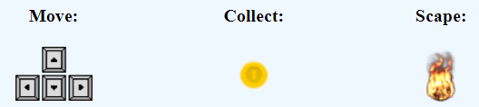
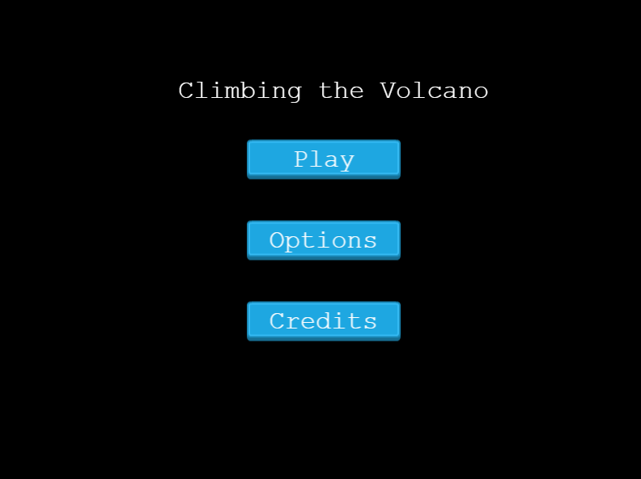
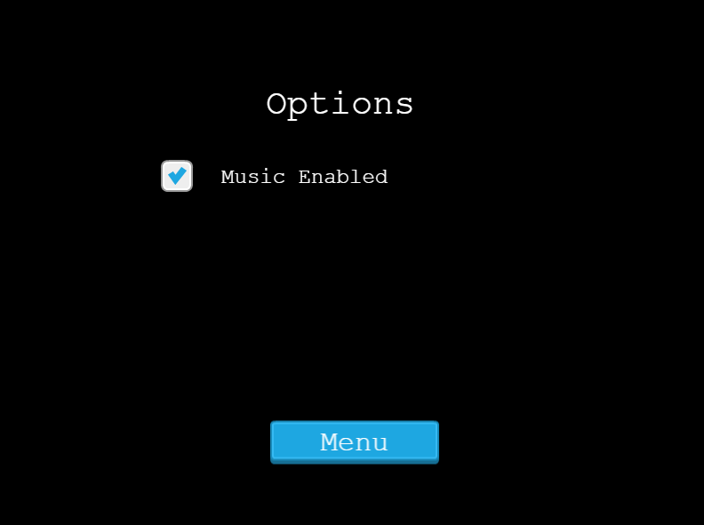
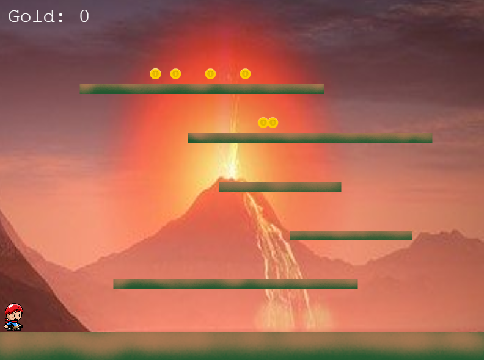
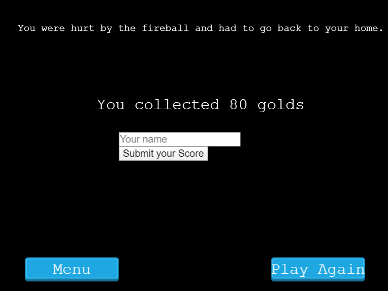
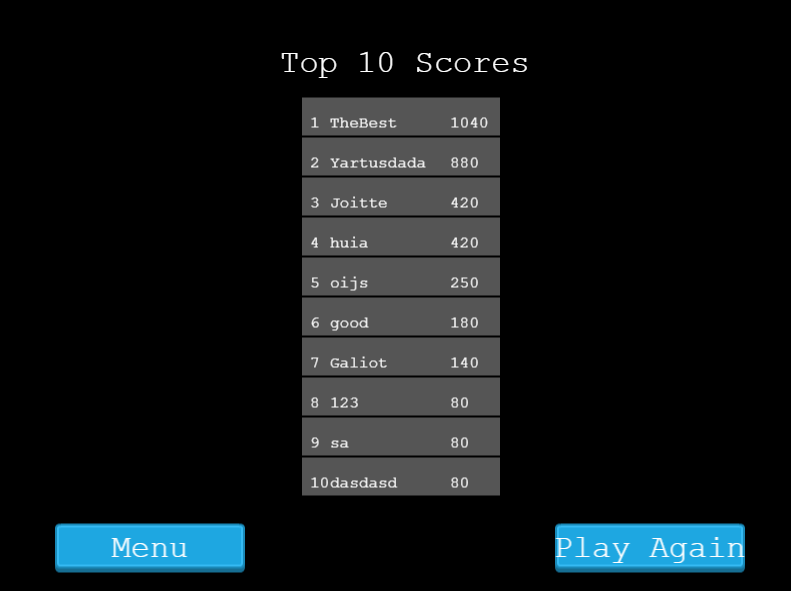

<h1 align="center">Climbing the Volcano - Phaser3</h1>

<h3 align="center">Capstone project - Microverse</h3>

<!-- TABLE OF CONTENTS -->

## Table of Contents

* [About the Project](#about-the-project)
  * [Built With](#built-with)
* [How to play](#how-to-play)
* [Run This App on your computer](#run-this-app-on-your-computer)
* [Run This App Online](#run-this-app-online)
* [Scenes](#scenes)
* [Future work](#future-work)
* [License](#license)
* [Contact](#contact)
* [Acknowledgements](#acknowledgements)
* [Credits](#credits)

<!-- ABOUT THE PROJECT -->
## About The Project

The final project of Microverse in the Javascript course, using the <a href="https://phaser.io/"> Phaser </a> framework.

In this game we aim to collect the coins while escaping the volcano fire. 

<a href="https://climbing-the-volcano-k1kdpckj8-felipeenne.vercel.app/"> Live version. </a>

### Built With 

* HTML
* CSS
* Git
* GitHub
* JavaScript
* API
* Phaser
* Jest
* Bundled with Webpack
* Linted with ESLINT

## How to play

When you are finished you can add your name and see if you are in the top 10.

## Run This App on your computer

* Clone or download this repository;
* Extract the game if you dowload;
* In your terminal, go to your game's folder;
* Run 'node server.js', yes you need the node to install this game
* Open, in your browser, 'localhost:8080'

## Run This App online 

<a href="https://climbing-volcano.herokuapp.com/"> Click here. </a>

## Scenes

<h3>Menu</h3>

<h3>Options</h3>

<h3>Game</h3>

<h3>Game Over</h3>

<h3>Top 10</h3>

## Future work

* Create a boss who will give you many coins

## License

Distributed under the MIT License. See `LICENSE` for more information.

<!-- CONTACT -->
## Contact
Felipe Enne Mendes Ribeiro
* Email - felipeenne@gmail.com
* <a href="https://www.linkedin.com/in/felipe-enne/" target="_blank">LinkedIn</a>
* <a href="https://felipeenne.com/" target="_blank">Portfolio</a>

<!-- ACKNOWLEDGEMENTS -->
## Acknowledgements

* <a href="https://www.microverse.org/"> Microverse</a>  and <a href="https://www.theodinproject.com/"> Odin Project</a>.

## Credits

Template - <a href=" https://phasertutorials.com/creating-a-phaser-3-template-part-1/"> Phaser GameDev Tutorials</a> 
Red haired boy - <a href="http://bevouliin.com"> Bevouliin 
Volcano - Image by Reimund Bertrams from Pixabay </a> 
Game Theme - <a href="https://www.youtube.com/watch?v=T_jbzbGwAGY"> Tyops </a>
