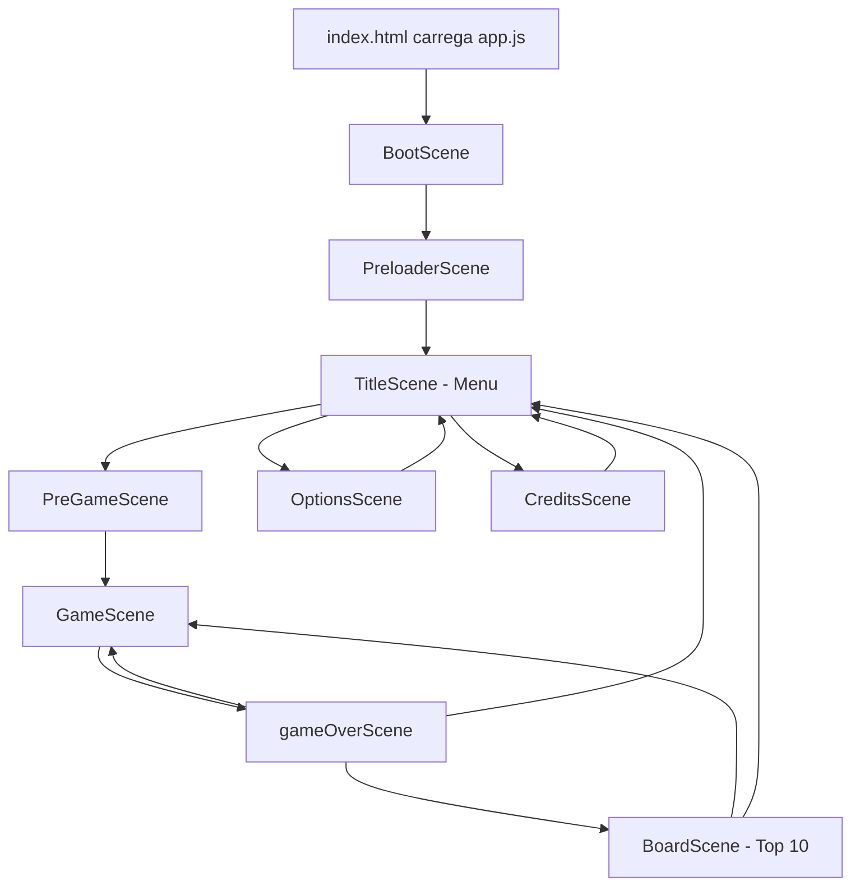
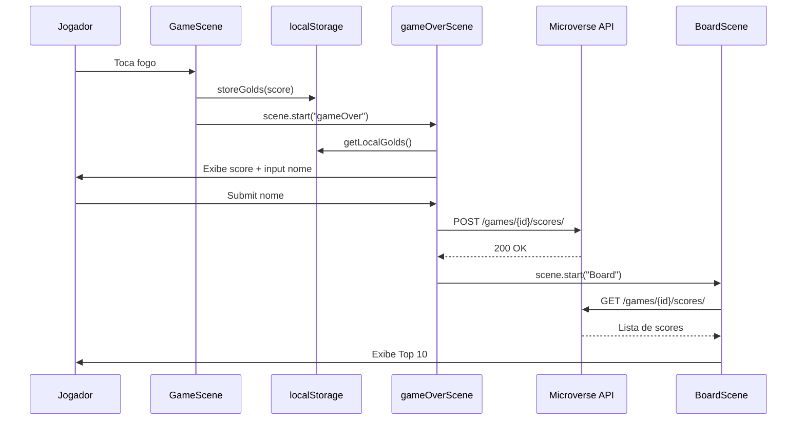

# Fluxos do Sistema — Climbing the Volcano

## Fluxo geral da aplicação



## Inicialização do jogo

1. `dist/index.html` carrega `app.js` e `production-dependencies.js` (Phaser separado).
2. `src/index.js` cria instância de `Phaser.Game` com config de `src/Config/config.js`.
3. Registra 9 cenas e inicia `Boot`.
4. `BootScene` imediatamente redireciona para `Preloader`.
5. `PreloaderScene`:
   - Exibe barra de progresso.
   - Carrega imagens, spritesheets, áudio e plugins Rex via CDN.
   - Após carregamento (ou timeout de 3s), vai para `Title`.

## Menu principal (TitleScene)

**Entrada:** após Preloader  
**Ações disponíveis:**

| Botão | Destino | Descrição |
|-------|---------|-----------|
| Play | PreGame | Inicia introdução |
| Options | Options | Configurações de áudio |
| Credits | Credits | Tela de créditos |

**Efeito colateral:** se música habilitada, inicia `bgMusic` e armazena referência em `game.globals.bgMusic`.

## Introdução (PreGameScene)

1. Exibe título e três linhas de contexto narrativo.
2. Animações tween movem textos para fora da tela (8s + delay 5s).
3. Ao final da última animação, inicia `Game` automaticamente.

## Gameplay (GameScene)

### Setup da partida
- `gold = 0`
- Gera 5 plataformas móveis com posições e sprites aleatórios
- Cria chão estático, jogador com física, moedas e grupo de fogos

### Loop de jogo (`update`)
- **Setas ← →:** move jogador (-300 / +300 px/s)
- **Seta ↑:** pulo (-330 velocity Y) se tocando o chão
- **Plataformas:** oscillam horizontalmente entre x≈100 e x≈700

### Coleta de moedas
1. Overlap jogador ↔ moeda
2. Moeda desabilitada, `gold += 10`
3. Texto HUD atualizado
4. Quando todas as moedas coletadas:
   - Respawn de moedas em posições aleatórias
   - Para cada 100 gold acumulados, spawna 1 bola de fogo no topo

### Game Over
1. Colisão jogador ↔ fogo
2. `storeGolds(this.gold)` → salva em `localStorage` (chave `golds`)
3. Pausa física, tint vermelho no jogador
4. Redireciona para `gameOver`

## Opções (OptionsScene)

1. Lê `game.globals.model`
2. Checkbox interativo alterna `model.musicOn`
3. Se desligado: para `bgMusic`, marca `bgMusicPlaying = false`
4. Se ligado: retoma música se não estiver tocando
5. Botão Menu → `Title`

**Não há persistência** das opções entre sessões (estado apenas em memória).

## Créditos (CreditsScene)

1. Anima textos de crédito subindo na tela
2. Ao final, retorna automaticamente para `Title`

## Game Over (gameOverScene)

### Exibição
- Mensagem narrativa de derrota
- Gold coletado lido de `localStorage` via `getLocalGolds()`
- Botões: Play Again → `Game`, Menu → `Title`

### Envio de pontuação
1. DOM HTML injetado via `this.add.dom()` com input de nome e botão Submit
2. Ao clicar Submit:
   - Valida que nome não está vazio
   - Chama `submitGold(nome, gold)` → API externa
   - Ao resolver promise, vai para `Board`
3. Input é ocultado após envio

**Não há validação de tamanho máximo do nome no código** (HTML tem `max="10"` mas isso não limita input text).

## Ranking (BoardScene)

1. Chama `getGoldBoard()` → `GET` na API externa
2. `sorting()` ordena scores decrescentemente
3. Renderiza tabela Top 10 com plugin Rex Grid Table
4. Cada célula mostra: posição, nome (truncado em 10 chars), score
5. Botões: Play Again → `Game`, Menu → `Title`

## Fluxo de dados — pontuação

```
GameScene (gold em memória)
        │
        │ hitfire → storeGolds(gold)
        ▼
localStorage ["golds"]
        │
        │ gameOverScene → getLocalGolds()
        ▼
gameOverScene (exibe + input nome)
        │
        │ submitGold(name, gold) → POST API
        ▼
API Microverse (persistência remota)
        │
        │ BoardScene → getGoldBoard() → GET API
        ▼
BoardScene (tabela Top 10)
```

## Chamadas de API

### Base URL
```
https://us-central1-js-capstone-backend.cloudfunctions.net/api/
```

### POST — Criar jogo (`initGame`)
- **Endpoint:** `POST /games/`
- **Body:** `{ "name": "Climbing the Volcano" }`
- **Uso em produção:** **não chamado** (apenas testado em `test/mockAPI.test.js`)
- **Resposta esperada:** `{ "result": "Game with ID: ..." }`

### POST — Enviar score (`submitGold`)
- **Endpoint:** `POST /games/91a9adf7a98b4b8490c6689a10fedb2f/scores/`
- **Body:** `{ "user": "<nome>", "score": <gold> }`
- **Chamado em:** `gameOverScene.js` após submit do jogador
- **Resposta esperada:** `{ "result": "Leaderboard score created correctly." }`

### GET — Listar ranking (`getGoldBoard`)
- **Endpoint:** `GET /games/91a9adf7a98b4b8490c6689a10fedb2f/scores/`
- **Chamado em:** `BoardScene.js` no `create()`
- **Resposta:** `{ "result": [{ "user": "...", "score": N }, ...] }`
- **Pós-processamento:** `sorting()` converte para array `[score, user]` ordenado

## Autenticação

**Não existe.** Qualquer visitante pode:
- Jogar sem login
- Enviar score com qualquer nome
- Ver o ranking público

## Integrações externas no fluxo

| Momento | Integração |
|---------|------------|
| Preloader | CDN GitHub — plugins Rex (input, grid table, scroller) |
| Game Over | API Microverse — POST score |
| Board | API Microverse — GET scores |
| Title | Áudio local (`assets/music/Theme.mp3`) |

## Fluxo de deploy

```
src/ ──webpack build──► dist/
                              │
                              ├── Vercel (estático)
                              └── Express local (npm start)
```

## Cenas não usadas no fluxo principal

O Preloader contém código comentado para iniciar diretamente em Board, Game ou gameOver (útil para debug):

```javascript
// this.scene.start('Board');
// this.scene.start('Game');
// this.scene.start('gameOver');
```

## Diagrama de sequência — envio de score


